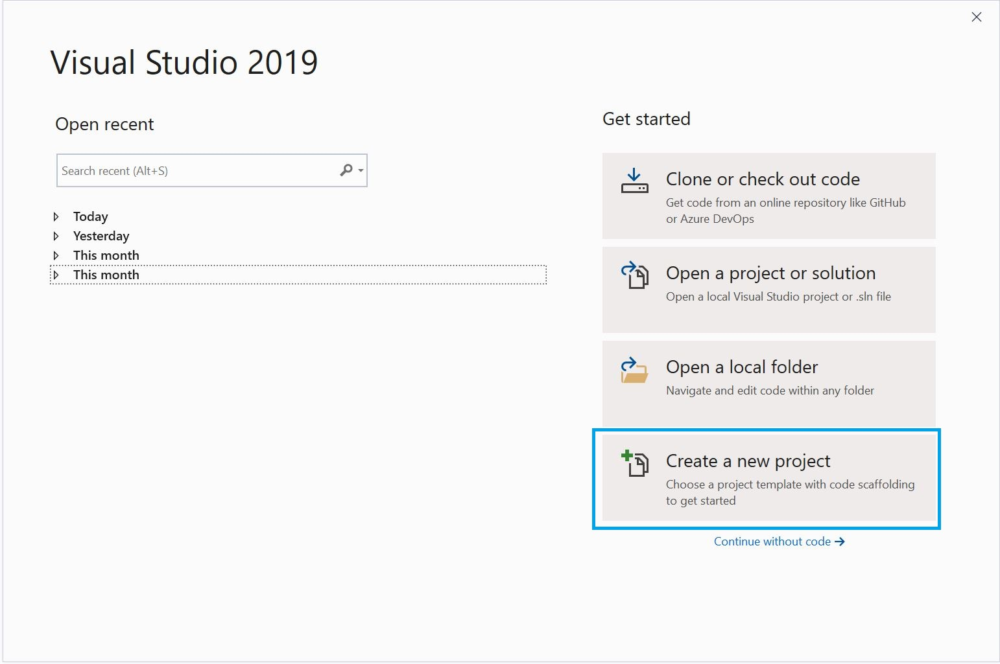
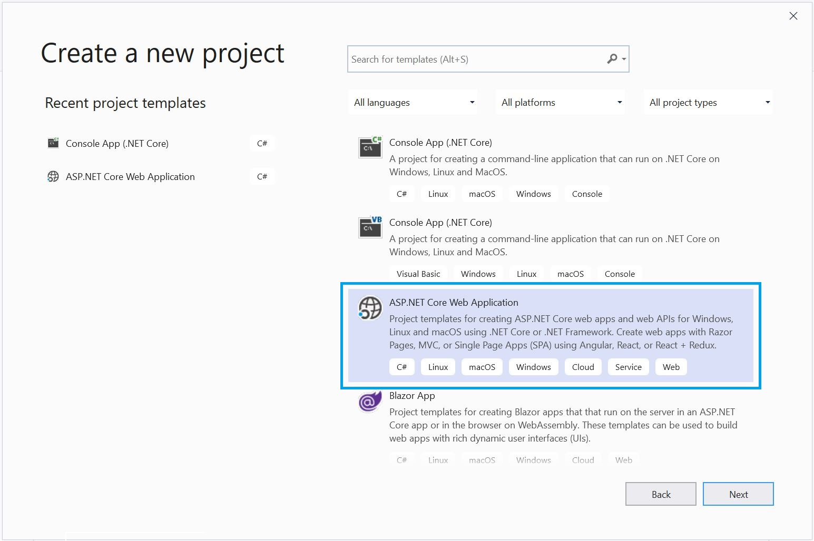
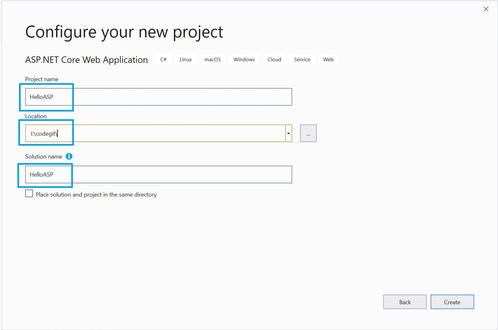
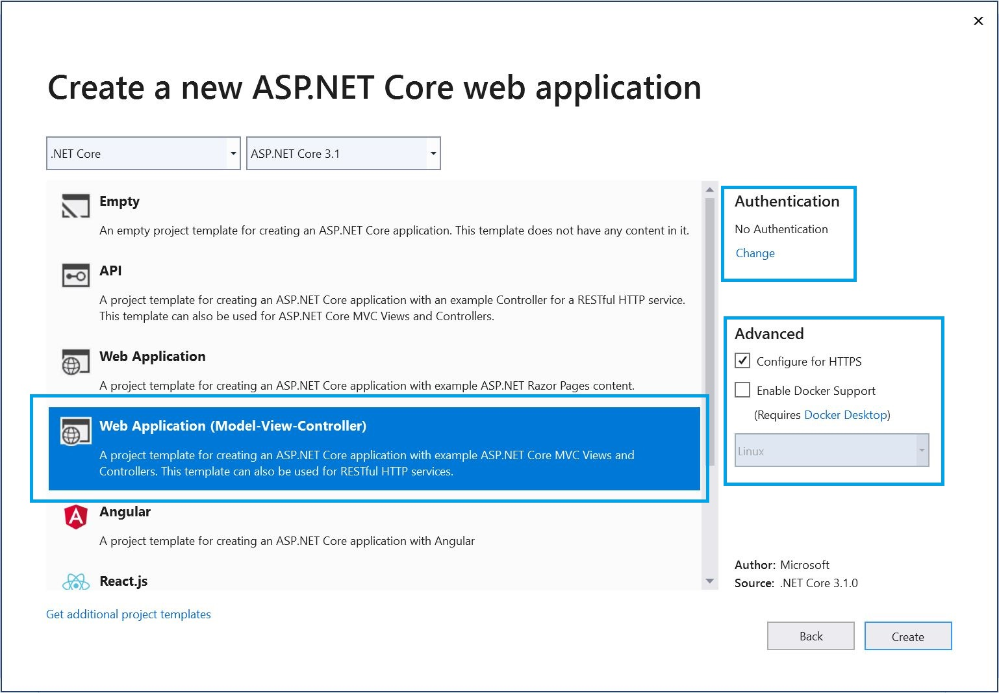
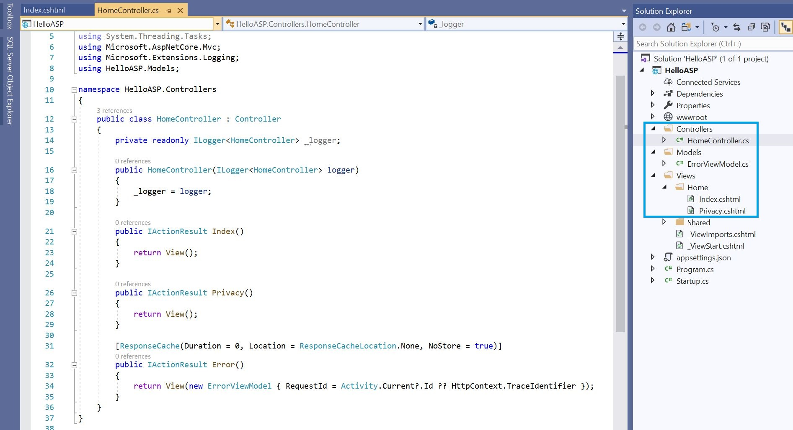
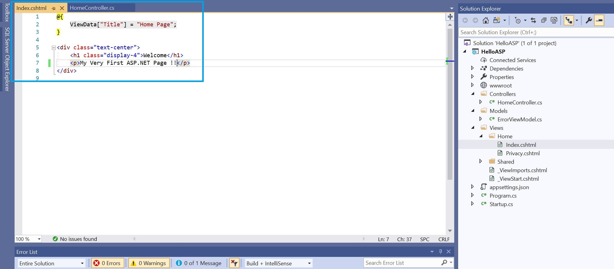
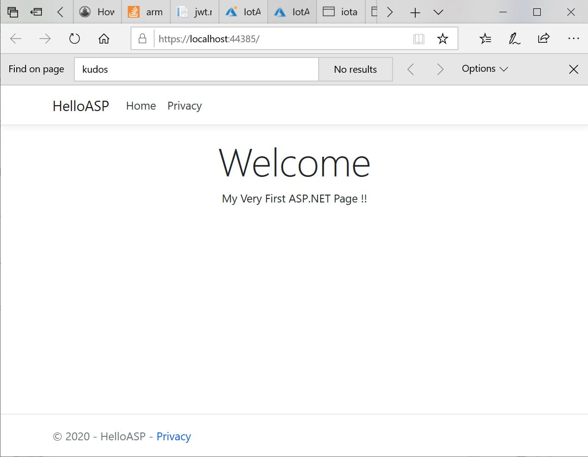

# Getting Started with ASP.NET Core

## PreRequiste
- Install Visul Studio Enterprise 2019
- Complete these courses on Pluralsight.com 
  - [For asp.net core web app devleopment](https://app.pluralsight.com/library/courses/building-aspdotnet-core-mvc-web-applications/table-of-contents)
  - [For bootstrap and CSS](https://app.pluralsight.com/library/courses/aspnetcore-mvc-efcore-bootstrap-angular-web/table-of-contents)

## Launch VS 2019

Launch Visual Studio 2019 from the Start Menu.

From the Home Page, Select the "Create a New Project".

## Create New Project

In the "Create New Project" Wizard, choose "ASP.NET Core Web Application"

## Configure Project Name

Provide the name for the Project and Choose the location where the project will reside.

## Configure Project Type

On the left side choose "Web Application (Model-View-Controller)" and leave the defaults on the right side as in the picture below. This template selection will precreate a lot of files in the project that will be very helpful to get started.

## Project Structure

The recommended pattern for Web Application Development is MVC, which stands for Model, View and Controller. These are the folders precreated in the Visual Studio Solution.

### Controller

There is only 1 controller in this project, the "Home" Controller.

### Model

There is only 1 model in this project, the "Error View" Model

### View

Typically there will be one folder for every controller. We have a "Home" Folder in view for the only Controller we have. For each action in Controller, there will be a "cshtml" file. There are 2 actions in the controller, and correspondingly we have 2 views:

- index.cshtml
- privary.cshtml

## Edit Our Custom String in "index.chtml"

Edit index.cshtml file in Views/Home to match the content present in the following picture.

## Compile and Run the Application

Hit Ctrl + F5 to compile and Run the Application. The new string added in the "index.cshtml" gets rendered in the Browser.

Congratulations on Creating your first ASP.NET Core Project
